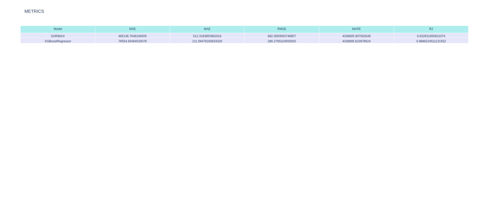
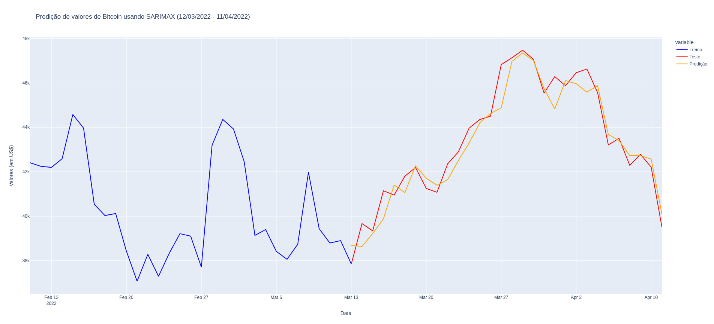
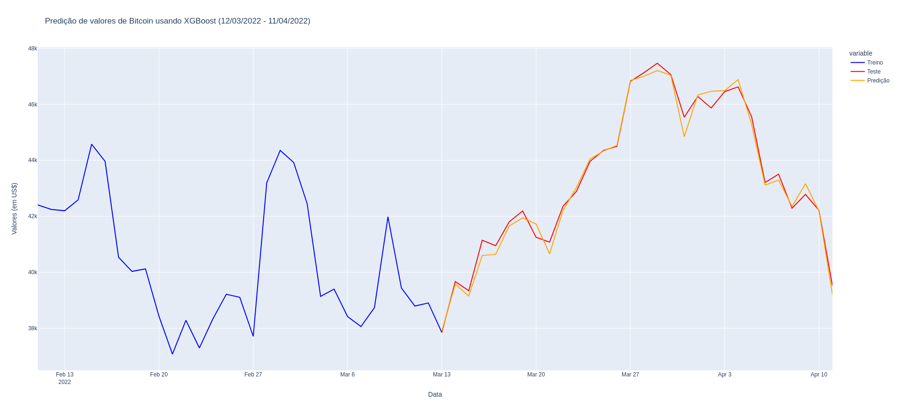

# Engenharia de Dados e Machine Learning com Airflow, Pandas, SARIMAX e XGBoost

## Objetivo
Construir um pipeline completo de dados que extrai os valores do Bitcoin em um intervalo de cinco anos, que faz predição de valores usando Machine Learning dentro de um intervalo de 30 dias, e dá como produto final:  
- Um gráfico interativo em página HTML com as predições do modelo SARIMAX (modelo de predições para séries temporais univariadas)
- Um gráfico interativo em página HTML com as predições do modelo XGBoostRegressor (modelo de Machine Learning para regressão)
- Uma tabela com métricas de avaliação dos modelos SARIMAX e XGBoostRegressor (MSE, MAE, RMSE, MAPE, R2)  
Estes três arquivos ficam na pasta $HOME/BitcoinPredictions após a DAG ser executada com sucesso.  

Neste projeto, usei o XCom do Airflow para transferir variáveis entre as funções dentro da classe BitcoinPredictions para que a DAG funcionasse bem e ficasse bem estruturada. Para que isso funcionasse, foi preciso mudar a seguinte configuração do arquivo airflow.cfg dentro da pasta ~/airflow/dags:  
> enable_xcom_pickling = True
  
A versão final se encontra no arquivo bitcoin_pandas_dag.py.   

## Recursos utilizados
- Visual Studio Code
- python3.9
- virtualenv
- pip3: gerenciador de pacotes python3.x

## Pacotes do Python
- airflow
- os
- pandas
- datetime
- calendar
- numpy
- plotly
- xgboost
- sklearn (Scikit-Learn)
- pmdarima

## Imagens do projeto

## Como executar localmente esse projeto em sua máquina
- baixe esse repositório localmente em sua máquina:  
> git clone https://github.com/rafaelcoelho1409/DataEngineering2.git  
- Instale os pacotes necessários que estão no arquivo dataeng_requirements.txt:  
> pip3 install -r dataeng2_requirements.txt  
- escolha seu interpretador python (python3, python3.x)  
- instale o airflow:  
> pip3 install apache-airflow  
- encontre a pasta de DAGs do Airflow na sua máquina (em geral, $AIRFLOW_HOME/dags ou ~/airflow/dags)    
- copie e cole o arquivo bitcoin_pandas_dag.py dentro desta pasta ($AIRFLOW_HOME/dags ou ~/airflow/dags)  
- acesse o Airflow pelo seu navegador (https://localhost:8080)  
- ative a DAG (bitcoin_dag_pandas) e execute ela (Trigger DAG)  
- orientações mais completas de automatização de dados com Airflow:  
> https://airflow.apache.org/docs/apache-airflow/stable/tutorial.html
